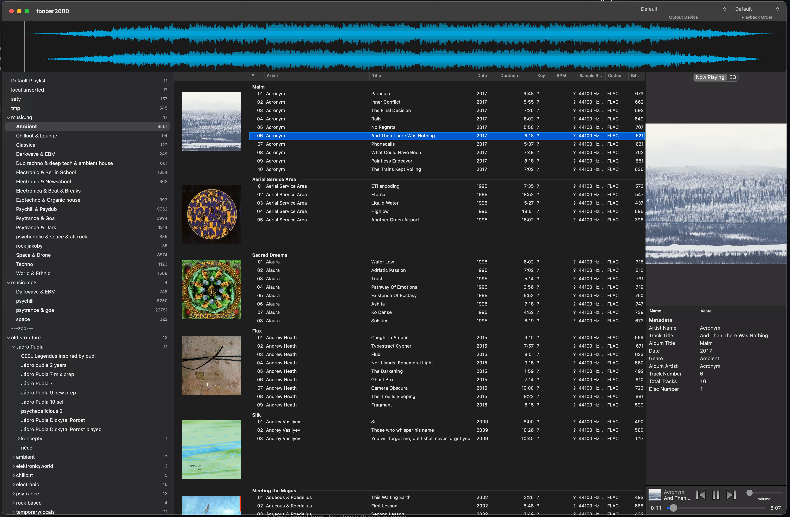
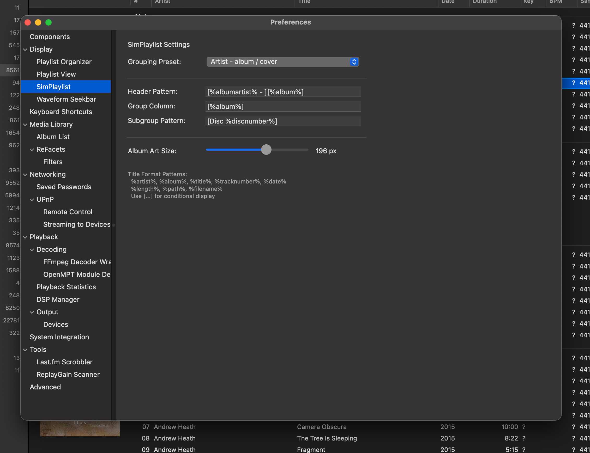
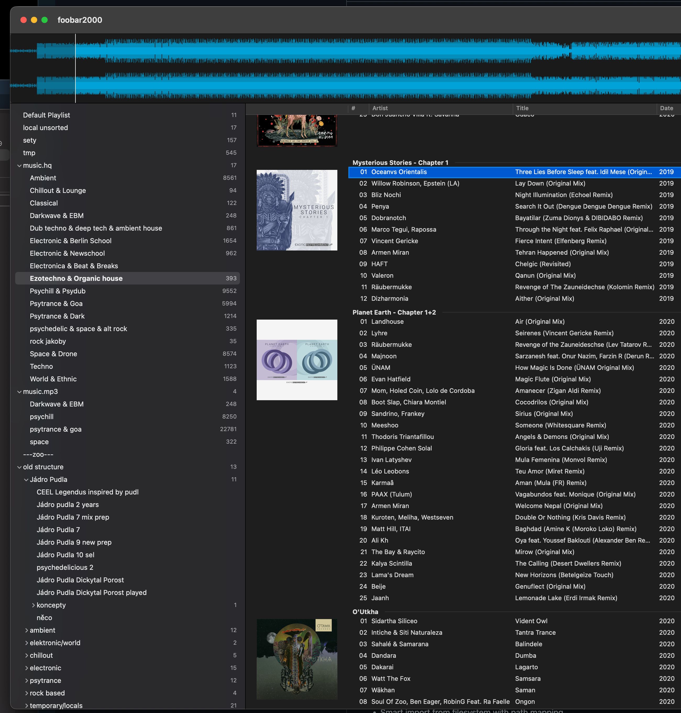
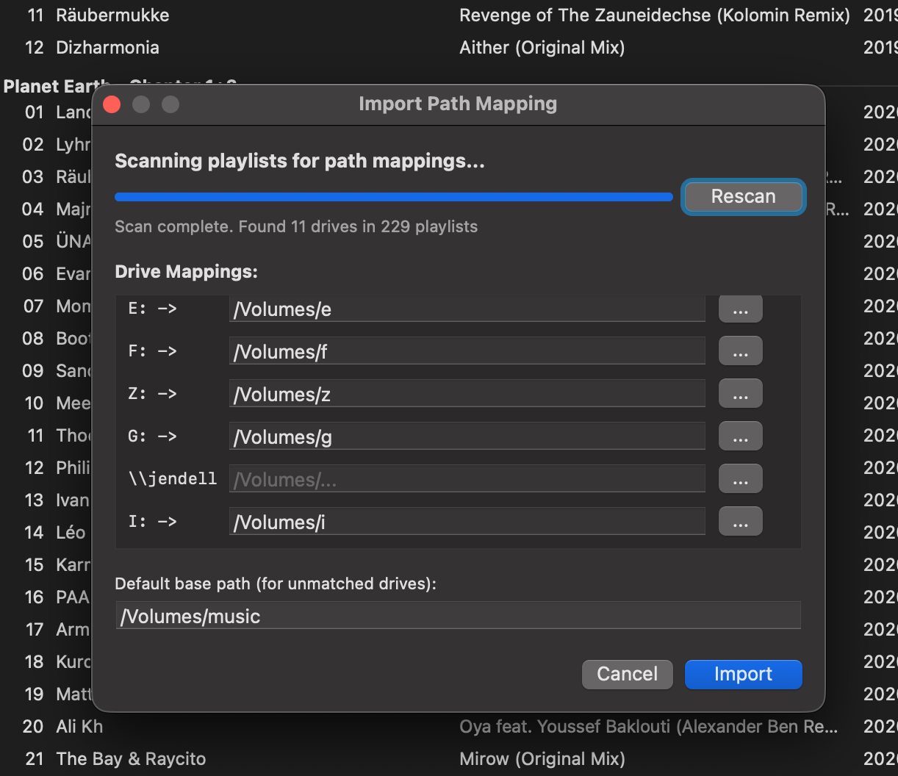
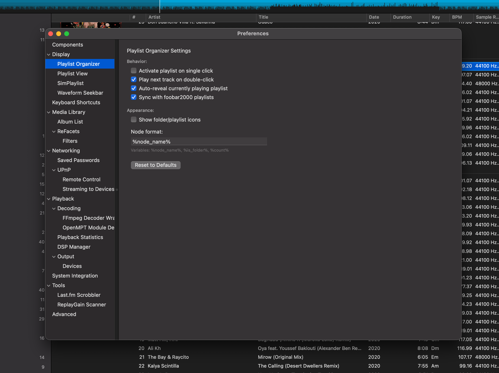
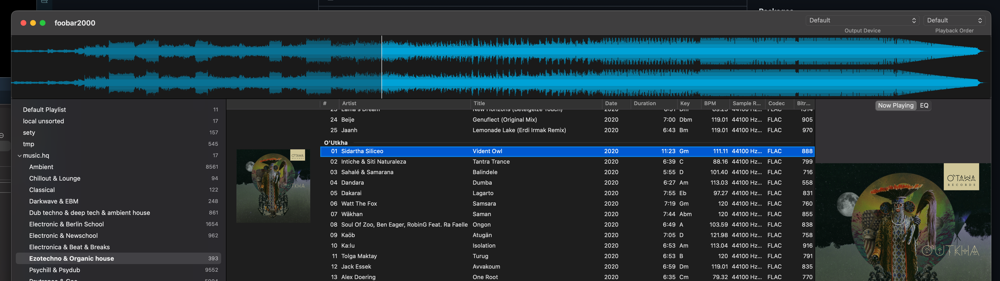
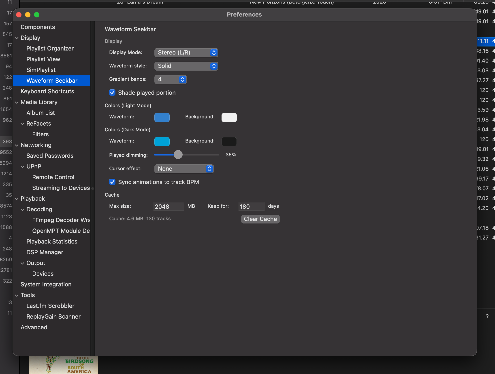
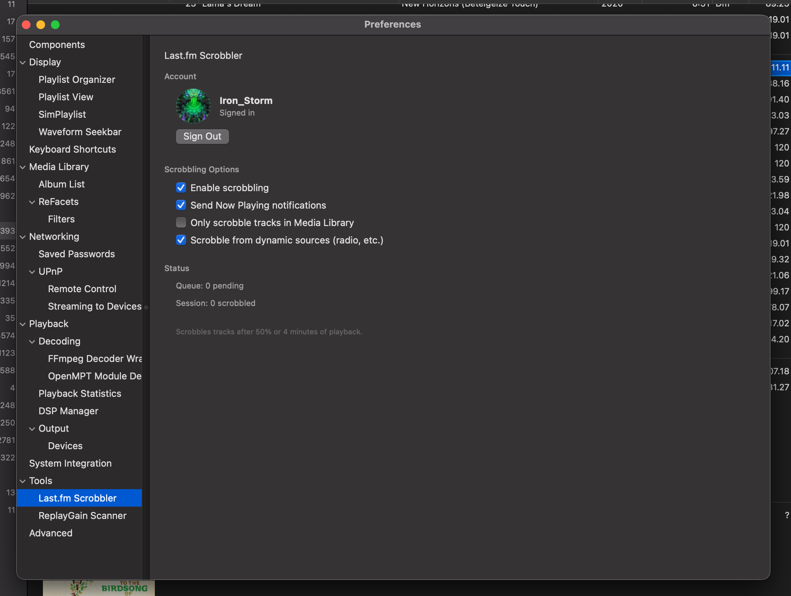

# foobar2000 macOS Components

A collection of macOS components for foobar2000 v2.

## Extensions

| Extension | Description | Version |
|-----------|-------------|---------|
| [SimPlaylist](#simplaylist) | Lightweight playlist viewer with album art and grouping | 1.0.0 |
| [Playlist Organizer](#playlist-organizer) | Tree-based playlist management | 1.0.0 |
| [Waveform Seekbar](#waveform-seekbar) | Audio visualization seekbar with effects | 1.0.0 |
| [Last.fm Scrobbler](#lastfm-scrobbler) | Last.fm integration and scrobbling | 1.0.0 |

---

### SimPlaylist

A flat playlist view with album grouping, embedded album art, and metadata display.

| Overview | Settings |
|----------|----------|
|  |  |

**Features:**
- Album-based grouping with customizable patterns
- Embedded album art thumbnails
- Multi-column track display
- Selection sync with foobar2000 playlist manager
- Virtual scrolling for large playlists

---

### Playlist Organizer

Tree-based playlist management with folder organization and smart import.

| Overview | Import Menu |
|----------|-------------|
|  |  |

| Path Mapping | Settings |
|--------------|----------|
|  |  |

**Features:**
- Hierarchical folder organization
- Drag-and-drop playlist reordering
- Smart import from filesystem with path mapping
- Autoplaylist support
- Playlist search and filtering

---

### Waveform Seekbar

Audio visualization seekbar with real-time waveform display and visual effects.

| Overview | Settings |
|----------|----------|
|  |  |

**Features:**
- Real-time waveform visualization
- Multiple display modes (bars, lines, filled)
- Customizable colors and effects
- Click-to-seek functionality
- Downmix/channel selection

---

### Last.fm Scrobbler

Last.fm integration for scrobbling and now-playing updates.



**Features:**
- Automatic track scrobbling after 50% or 4 minutes
- Now Playing notifications
- Browser-based Last.fm authentication
- Offline queue with automatic retry
- Library-only and dynamic source filtering

---

## Downloads

| Component | Download | Forum |
|-----------|----------|-------|
| SimPlaylist | [All Releases](https://github.com/JendaT/fb2k-components-mac-suite/releases?q=simplaylist) | TBD |
| Playlist Organizer | [All Releases](https://github.com/JendaT/fb2k-components-mac-suite/releases?q=plorg) | TBD |
| Waveform Seekbar | [All Releases](https://github.com/JendaT/fb2k-components-mac-suite/releases?q=waveform) | TBD |
| Last.fm Scrobbler | [All Releases](https://github.com/JendaT/fb2k-components-mac-suite/releases?q=scrobble) | TBD |

## Installation

1. Download the `.fb2k-component` file from the links above
2. Double-click to install, or manually copy to `~/Library/foobar2000-v2/user-components/`
3. Restart foobar2000

## Requirements

- foobar2000 v2.6+ for macOS
- macOS 11 "Big Sur" or newer
- Intel or Apple Silicon processor

## Building from Source

Each extension can be built independently:

```bash
cd extensions/foo_jl_<name>_mac  # e.g., foo_jl_simplaylist_mac
ruby Scripts/generate_xcode_project.rb
./Scripts/build.sh
./Scripts/install.sh
```

Or build all extensions:

```bash
./Scripts/build_all.sh [--clean] [--install]
```

## Documentation

- [Knowledge Base](knowledge_base/) - SDK patterns and best practices
- [Contributing](CONTRIBUTING.md) - Code standards and conventions
- [Changelog](CHANGELOG.md) - Version history

## Author

Hi there, I'm a random long-term foobar2000 enjoyer, who had to migrate to MacOS a few years back and have been waiting for some movement on the components field for quite some time. Now after some experience with Claude I put together what was necessary for it to start building the tools which I loved so much when I used foobar on windows.

If you like this project, you can support it here.

[](https://ko-fi.com/jendalegenda)

## License

MIT License - see [LICENSE](LICENSE)
