# foobar2000 macOS Components

A collection of macOS components for foobar2000 v2 – mostly remakes of the components, which I used to love back then on windows.

DISCLAIMER: All of this is a WIP, actively tested on my foobar2000 instance, but WIP nonetheless, it may crash your foobar.

## Extensions

| Extension | Description | Version | Docs |
|-----------|-------------|---------|------|
| [SimPlaylist](#simplaylist) | Lightweight playlist viewer with album art and grouping | 1.5.1 | [📖](docs/simplaylist.md) |
| [Playlist Organizer](#playlist-organizer) | Tree-based playlist management | 1.5.0 | [📖](docs/plorg.md) |
| [Waveform Seekbar](#waveform-seekbar) | Audio visualization seekbar with effects | 1.2.0 | [📖](docs/waveform.md) |
| [Spectrum Analyzer](#spectrum-analyzer) | Real-time frequency spectrum with bars or curve display | 0.2.0 | [📖](docs/spectrum.md) |
| [Vectorscope](#vectorscope) | Stereo goniometer with afterglow and phase correlation meter | 0.1.0 | [📖](docs/vectorscope.md) |
| [Album Art (Extended)](#album-art-extended) | Multi-type album art viewer with selection support | 1.0.1 | [📖](docs/albumart.md) |
| [Queue Manager](#queue-manager) | Visual playback queue management | 1.2.0 | [📖](docs/queuemanager.md) |
| [Last.fm Scrobbler](#lastfm-scrobbler) | Last.fm integration and scrobbling | 1.4.0 | – |
| [Effects DSP](#effects-dsp) | 11 audio effects (echo, reverb, pitch shift, etc.) | 1.0.0 | – |

---

### SimPlaylist

A flat playlist view with album grouping, embedded album art, and metadata display. The one plugin, which makes playlists nicer.

| Overview | Settings |
|----------|----------|
| 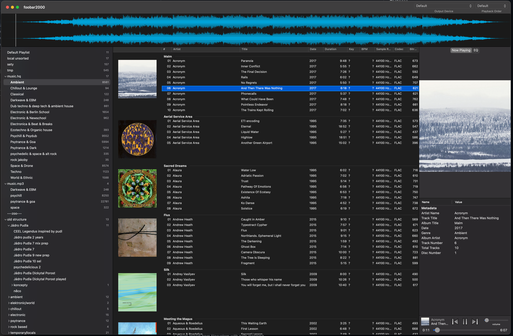 | 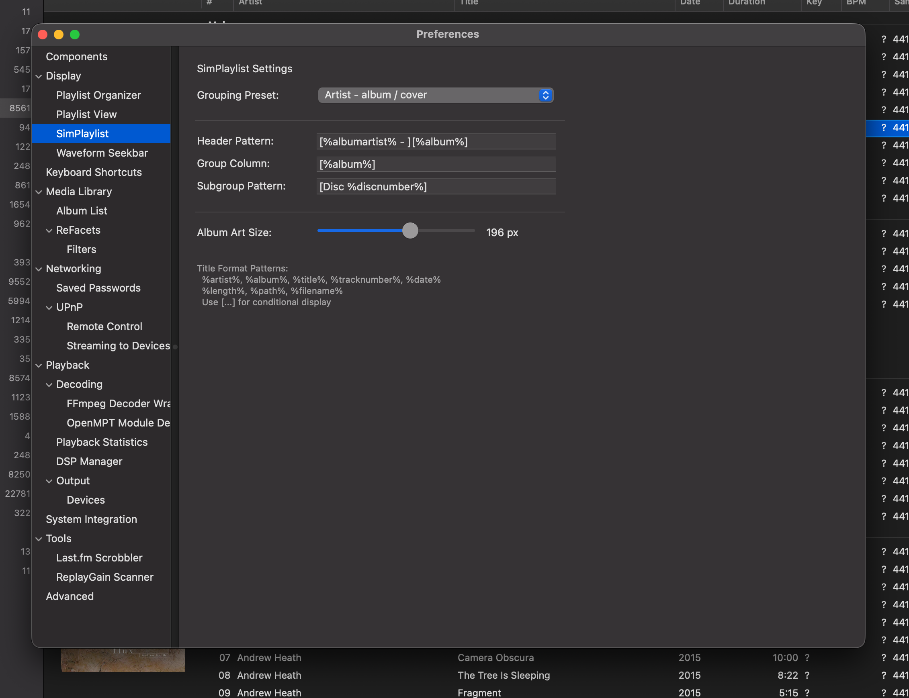 |

**Features:**
- Album-based grouping with customizable patterns
- Embedded album art thumbnails
- Multi-column track display
- Selection sync with foobar2000 playlist manager
- Virtual scrolling for large playlists

---

### Playlist Organizer

Tree-based playlist management with folder organization and smart import. Necesity to manage playlists more managable. No nice screenshots of hyper-organized playlists yet, they are scattered, but there are some import tools to import either from old windows thheme.fth or from Strawberry, which became an alternative for a time being.

| Overview | Import Menu |
|----------|-------------|
| 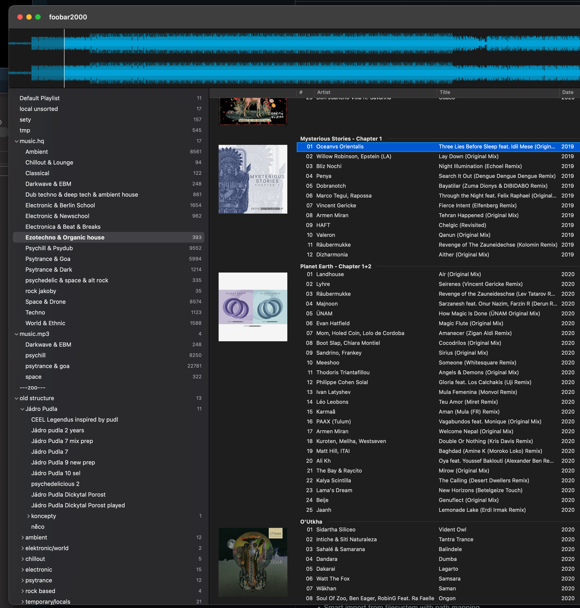 | 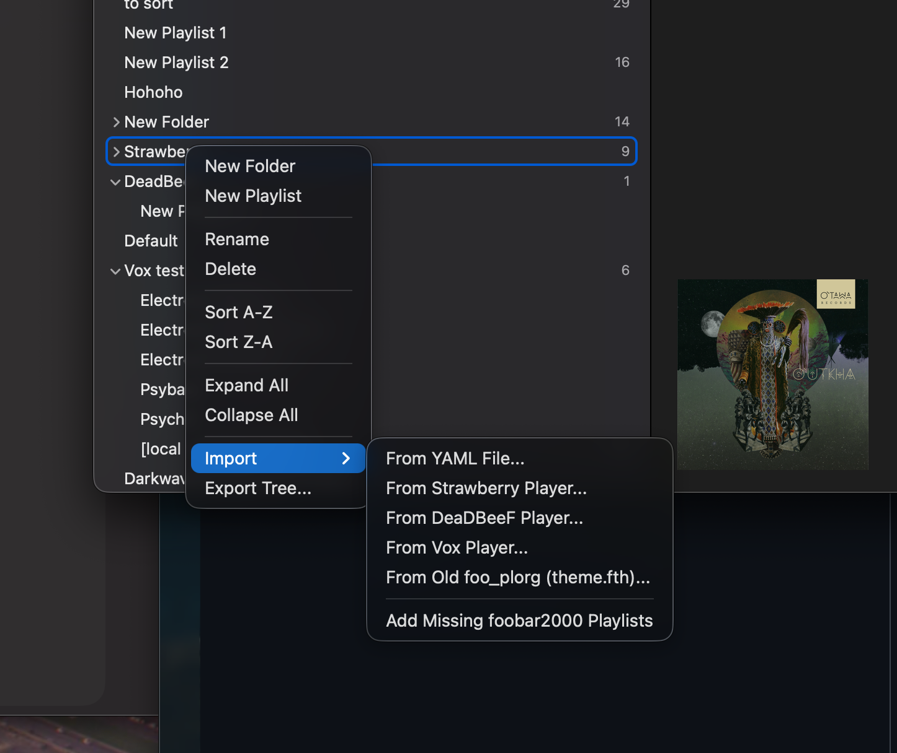 |

| Path Mapping | Settings |
|--------------|----------|
| 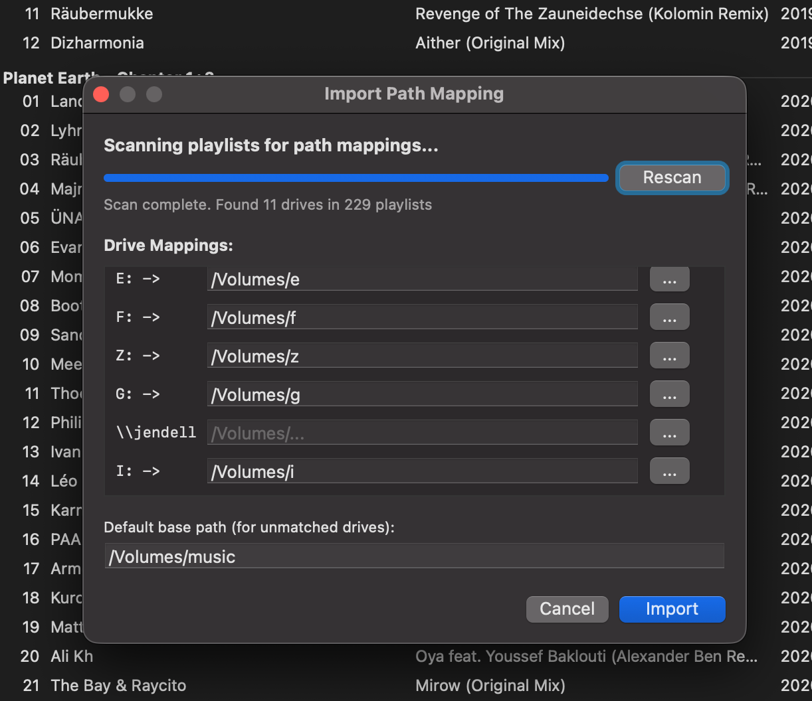 | 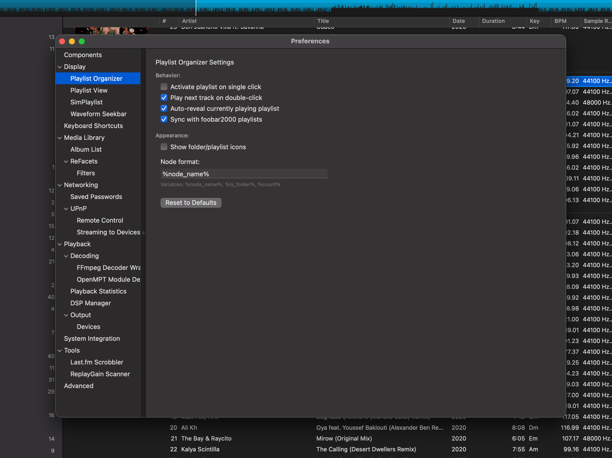 |

**Features:**
- Hierarchical folder organization
- Drag-and-drop playlist reordering
- Smart import from filesystem with path mapping
- Autoplaylist support
- Playlist search and filtering

---

### Waveform Seekbar

Audio visualization seekbar with real-time waveform display and visual effects. This one was my favorite, a neat way to navigate through tracks.

| Overview | Settings |
|----------|----------|
| 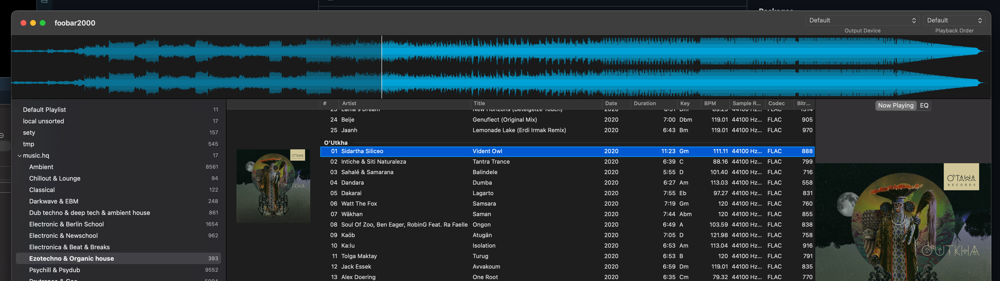 | 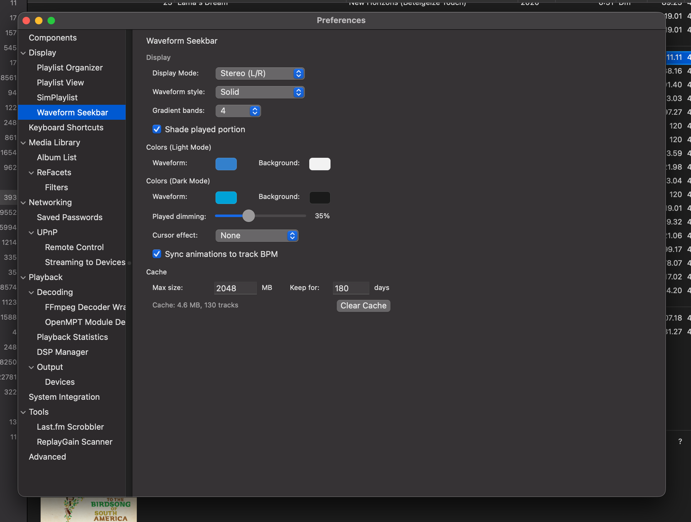 |

**Features:**
- Real-time waveform visualization
- Multiple display modes (bars, lines, filled)
- Customizable colors and effects
- Click-to-seek functionality
- Downmix/channel selection

---

### Spectrum Analyzer

Real-time spectrum analyzer panel, built on foobar2000's own FFT visualisation stream.

| Overview | Settings |
|----------|----------|
| 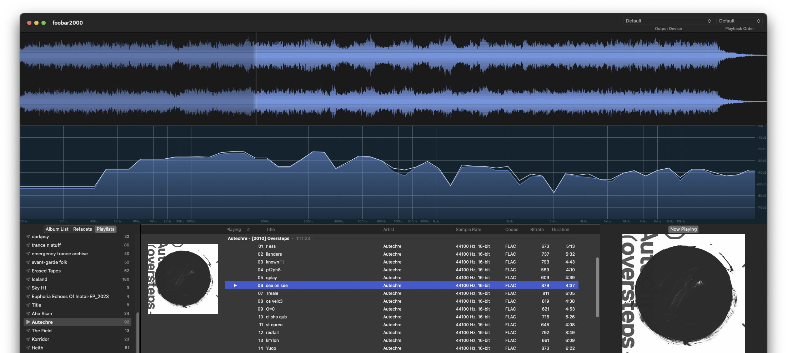 | 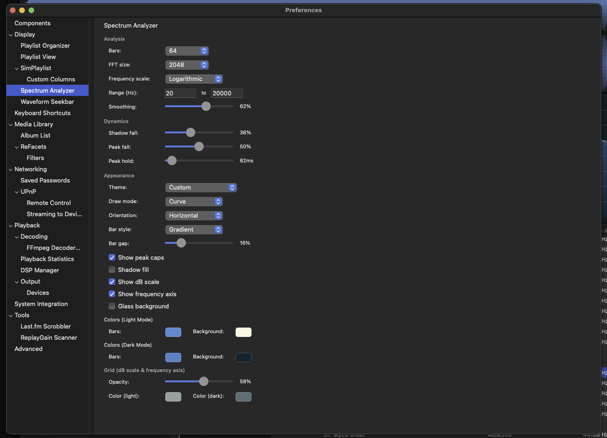 |

**Features:**
- Bars or filled curve display, horizontal or vertical orientation
- Logarithmic or linear frequency scale with adjustable range (default 20 Hz – 20 kHz)
- Falling peak line and slow-decaying shadow fill
- dB guides and frequency gridlines with adjustable opacity
- Bar styles (solid, gradient, spectrum hue) and color presets (Nord, Dracula, Gruvbox, Solarized, Tokyo Night, ...) with separate light/dark colors and optional glass background
- Auto bar count that fits the panel (up to 2048 bars), or fixed presets
- Per-bar frequency labels; click and hold to read the exact frequency under the cursor
- Tunable FFT size, smoothing and peak/shadow fall speeds

---

### Vectorscope

Stereo vectorscope (goniometer) panel with an oscilloscope-style afterglow and a phase correlation meter, fed by foobar2000's visualisation stream.

| Overview | Settings |
|----------|----------|
| 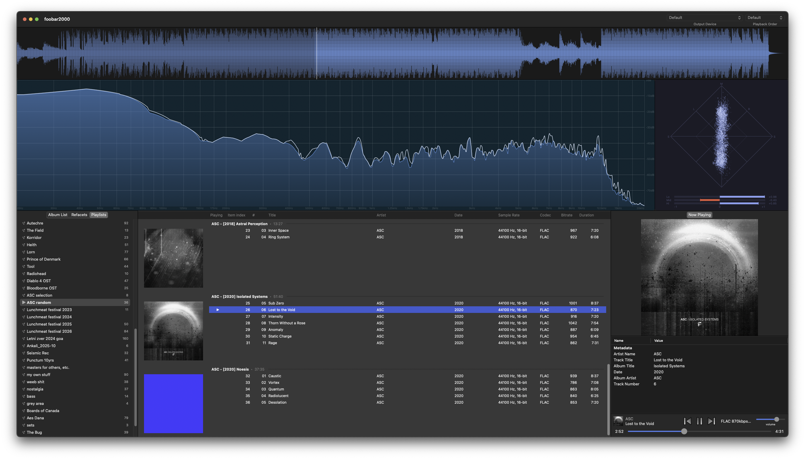 | 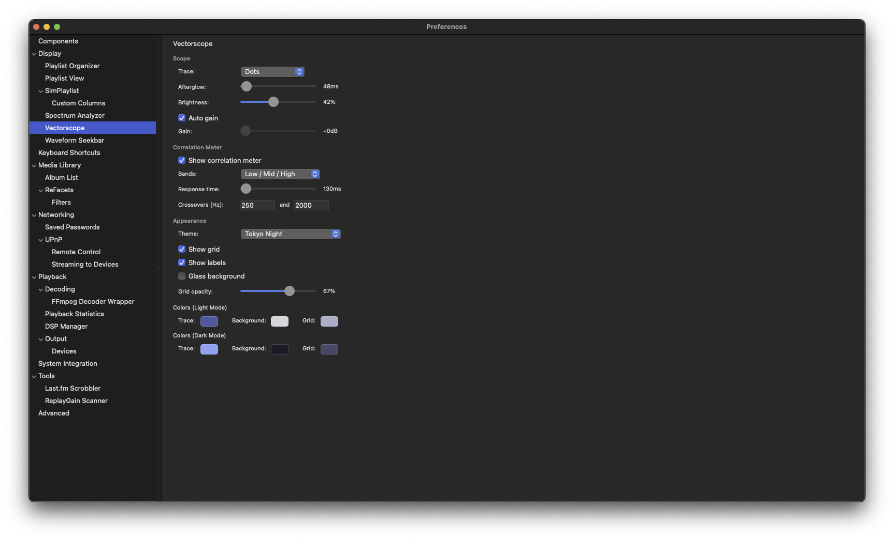 |

**Features:**
- Goniometer display: mono is a vertical line, out-of-phase material spreads horizontally
- Afterglow trace drawn as lines or dots, with adjustable persistence and brightness
- Auto gain so quiet and loud tracks both fill the scope, or a fixed gain
- Phase correlation meter, broadband or split into low / mid / high bands with adjustable crossovers
- Diamond grid with L / R / M / S labels and adjustable opacity
- Color presets (Phosphor Green, Amber, Nord, Dracula, Gruvbox, ...) with separate light/dark colors and optional glass background

---

### Album Art (Extended)

Extended album art viewer with support for multiple artwork types and selection-based display. Unlike the built-in album art element, this one can show back covers, disc art, and more.

**Features:**
- Display front, back, disc, icon, or artist artwork
- Shows artwork for selected track (falls back to now playing)
- Right-click context menu to switch artwork type
- Navigation arrows on hover to cycle through available types
- Per-instance configuration (each panel remembers its type)
- Layout parameters for default artwork type

**Layout Usage:**
```
albumart_ext                    # Front cover (default)
albumart_ext type=back          # Back cover
albumart_ext type=disc          # Disc art

# Dual panel layout (front + back side by side)
splitter horizontal
  albumart_ext type=front
  albumart_ext type=back
```

---

### Queue Manager

Visual playback queue manager - functionality that exists in Windows foobar2000 but was missing on macOS. See all queued tracks and manage playback order.

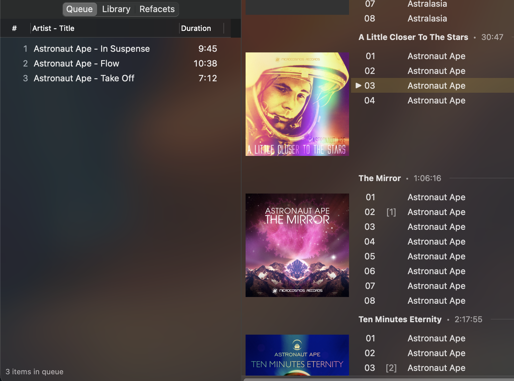

**Features:**
- Visual queue display with item count
- Drag & drop reordering (multiple rows at once) and drops from SimPlaylist
- Live updates when queue changes
- Double-click or Enter to play, Delete to remove
- Queue restored after restart
- Stop After Queue: stop playback when the queue runs out (Playback menu, context menu, preferences)

---

### Last.fm Scrobbler

Last.fm integration for scrobbling and now-playing updates. An absolute necesity for us, who celebrated 20 years of last.fm scrobbling this year.

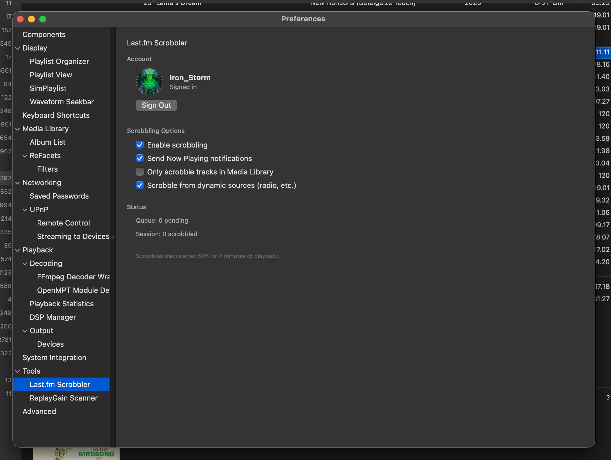

**Features:**
- Automatic track scrobbling after 50% or 4 minutes
- Now Playing notifications
- Browser-based Last.fm authentication
- Offline queue with automatic retry
- Library-only and dynamic source filtering

---

### Effects DSP

A collection of 11 real-time audio effects -- a macOS port of [foo_dsp_effect](https://github.com/mudlord/foo_dsp_effect) by mudlord. The original Windows component provides standard audio effects that were missing from foobar2000's default installation; this brings them to macOS.

**Effects:**
- Echo, Tremolo, IIR Filter (12 biquad types)
- Reverb (Freeverb), Phaser, WahWah
- Chorus, Vibrato
- Pitch Shift, Tempo Shift, Rate Shift (SoundTouch)

Each effect registers as a separate DSP in foobar2000's chain (Preferences > Playback > DSP Manager), with its own native config popup.

---

## Downloads

| Component | Download | Forum |
|-----------|----------|-------|
| SimPlaylist | [All Releases](https://github.com/JendaT/fb2k-components-mac-suite/releases?q=simplaylist) | TBD |
| Playlist Organizer | [All Releases](https://github.com/JendaT/fb2k-components-mac-suite/releases?q=plorg) | TBD |
| Waveform Seekbar | [All Releases](https://github.com/JendaT/fb2k-components-mac-suite/releases?q=waveform) | TBD |
| Spectrum Analyzer | [All Releases](https://github.com/JendaT/fb2k-components-mac-suite/releases?q=spectrum) | TBD |
| Vectorscope | [All Releases](https://github.com/JendaT/fb2k-components-mac-suite/releases?q=vectorscope) | TBD |
| Album Art (Extended) | [All Releases](https://github.com/JendaT/fb2k-components-mac-suite/releases?q=albumart) | TBD |
| Queue Manager | [All Releases](https://github.com/JendaT/fb2k-components-mac-suite/releases?q=queuemanager) | [Hydrogenaudio](https://hydrogenaudio.org/index.php/topic,129975.new.html) |
| Last.fm Scrobbler | [All Releases](https://github.com/JendaT/fb2k-components-mac-suite/releases?q=scrobble) | TBD |
| Effects DSP | [All Releases](https://github.com/JendaT/fb2k-components-mac-suite/releases?q=effects-dsp) | TBD |

## Installation

1. Download the `.fb2k-component` file from the links above
2. Double-click to install, or manually copy to `~/Library/foobar2000-v2/user-components/`
3. Restart foobar2000

## Requirements

- foobar2000 v2.6+ for macOS
- macOS 11 "Big Sur" or newer (Playlist Organizer and Queue Manager: macOS 12 "Monterey" or newer)
- Intel or Apple Silicon processor

## Building from Source

### Prerequisites

- Xcode (install from the App Store, then run `xcode-select --install`)
- Ruby (bundled with macOS)

### 1. Download and build the SDK

The foobar2000 SDK is not included in this repository. Download it from
[foobar2000.org/SDK](https://www.foobar2000.org/SDK) and extract it so the
directory layout looks like this:

```
fb2k-components-mac-suite/
└── SDK-2025-03-07/          # exact name must match the downloaded archive
    ├── pfc/
    ├── foobar2000/
    │   ├── SDK/
    │   ├── helpers/
    │   ├── shared/
    │   └── foobar2000_component_client/
    └── ...
```

Then build the SDK libraries **in this order** (each must succeed before the next):

```bash
SDK=SDK-2025-03-07

xcodebuild -project $SDK/pfc/pfc.xcodeproj                                                         -configuration Release
xcodebuild -project $SDK/foobar2000/SDK/foobar2000_SDK.xcodeproj                                   -configuration Release
xcodebuild -project $SDK/foobar2000/shared/shared.xcodeproj                                        -configuration Release
xcodebuild -project $SDK/foobar2000/helpers/foobar2000_SDK_helpers.xcodeproj                       -configuration Release
xcodebuild -project $SDK/foobar2000/foobar2000_component_client/foobar2000_component_client.xcodeproj -configuration Release
```

This only needs to be done once (or when the SDK version changes).

### 2. Build a component

```bash
cd extensions/foo_jl_<name>_mac  # e.g., foo_jl_simplaylist_mac
ruby Scripts/generate_xcode_project.rb
./Scripts/build.sh          # --release is the default; use --debug for a debug build
./Scripts/install.sh
```

Or build all extensions at once:

```bash
./Scripts/build_all.sh [--clean] [--install]
```

## Documentation

### Component Documentation
- [SimPlaylist](docs/simplaylist.md) - Features, configuration, and usage
- [Playlist Organizer](docs/plorg.md) - Features, configuration, and usage
- [Waveform Seekbar](docs/waveform.md) - Features, configuration, and usage
- [Album Art (Extended)](docs/albumart.md) - Features, configuration, and usage
- [Queue Manager](docs/queuemanager.md) - Features, configuration, and usage
- [Spectrum Analyzer](docs/spectrum.md) - Features, configuration, and usage
- [Vectorscope](docs/vectorscope.md) - Features, configuration, and usage

### Development
- [Knowledge Base](knowledge_base/) - SDK patterns and best practices
- [Contributing](CONTRIBUTING.md) - Code standards and conventions
- [Troubleshooting](docs/TROUBLESHOOTING.md) - Debug tools and common issues
- [Changelog](CHANGELOG.md) - Version history

## Author

Hi there, I'm a random long-term foobar2000 enjoyer, who had to migrate to MacOS a few years back and have been waiting for some movement on the components field for quite some time. Now after some experience with Claude I put together what was necessary for it to start building the tools which I loved so much when I used foobar on windows.

If you like this project, you can support it here.

[](https://ko-fi.com/jendalegenda)

## Layout Editor

To add these components to your layout, use **View → Layout → Enable Layout Editing Mode**, then right-click to add UI elements.

### Component Names for Layout

Use these names in the layout editor or when editing the layout text file directly:

| Component | Recommended | Also Accepted |
|-----------|-------------|---------------|
| SimPlaylist | `simplaylist` | `SimPlaylist`, `foo_jl_simplaylist`, `jl_simplaylist` |
| Playlist Organizer | `plorg` | `playlist-organizer`, `foo_jl_plorg`, `jl_plorg` |
| Waveform Seekbar | `waveform-seekbar` | `waveform_seekbar`, `foo_jl_wave_seekbar`, `jl_wave_seekbar` |
| Spectrum Analyzer | `spectrum` | `Spectrum Analyzer`, `spectrum_analyzer`, `foo_jl_spectrum`, `jl_spectrum` |
| Vectorscope | `vectorscope` | `Vectorscope`, `vector_scope`, `goniometer`, `foo_jl_vectorscope`, `jl_vectorscope` |
| Album Art (Extended) | `albumart_ext` | `album_art_ext`, `albumart-ext`, `foo_jl_album_art`, `jl_album_art` |
| Queue Manager | `Queue Manager` | `queue_manager`, `QueueManager`, `Queue`, `foo_jl_queue_manager` |

### Example Layout

Here's a complete layout configuration featuring the UI components:

```
splitter horizontal style=thin
  waveform-seekbar
  spectrum
  splitter vertical style=thin
    splitter horizontal style=thin
      plorg tab-name="Playlists"
    splitter horizontal style=thin
      simplaylist
    splitter horizontal style=thin
      tabs
        splitter horizontal style=thin tab-name="Now Playing"
          albumart
          selection-properties sections=metadata
        audiounit mode=visualization name=AUGraphicEQ vendor=Apple tab-name="EQ"
      playback-controls
```

This creates a layout with:
- Waveform seekbar at the top
- Spectrum analyzer below it
- Playlist Organizer on the left sidebar
- SimPlaylist as the main playlist view
- Tabbed panel with Now Playing info and EQ visualization
- Playback controls at the bottom

---

## License

MIT License - see [LICENSE](LICENSE)
