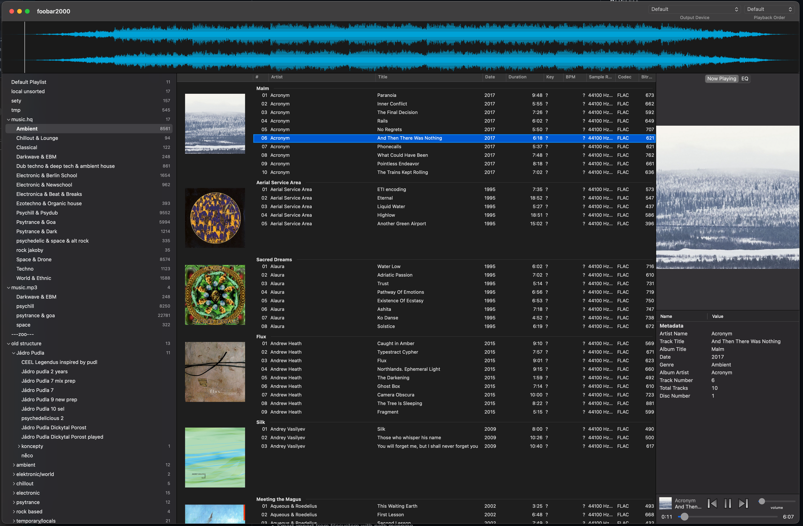
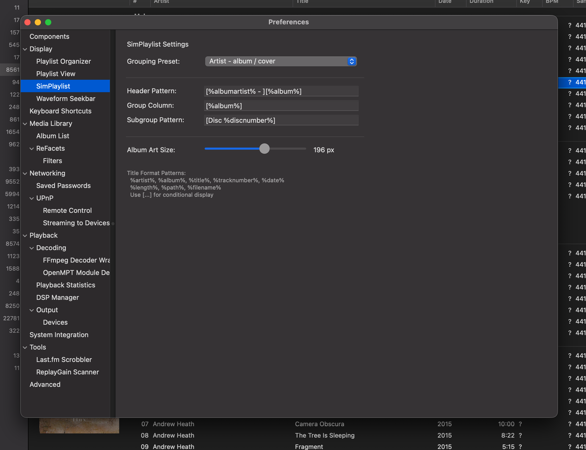

# SimPlaylist

A streamlined playlist view with album grouping and cover art display for foobar2000 macOS.

## Features

### Album Grouping with Cover Art

SimPlaylist automatically groups tracks by album and displays album artwork alongside your music. Click on album art to select all tracks in that album.

<!-- Screenshot: Overview showing album groups with artwork -->


### Header Display Styles

Three configurable header display modes to match your preference:

| Style | Description |
|-------|-------------|
| **Above tracks** | Header row appears above track rows with separator line |
| **Album art aligned** | Header text starts at left edge, aligned with album art |
| **Inline** | Compact header style with smaller text, no separator line |

<!-- Screenshot: Comparison of header styles -->

### Now Playing Highlight

Optional yellow shading highlights the currently playing track, making it easy to spot in large playlists.

<!-- Screenshot: Now playing highlight example -->

### Subgroup Support

Display disc numbers as subgroups within album groups - perfect for multi-disc albums.

<!-- Screenshot: Multi-disc album with subgroups -->

### Virtual Scrolling

Efficiently handles playlists of any size with smooth scrolling performance.

### Keyboard Navigation

Full keyboard support:
- **Arrow keys** - Navigate between tracks
- **Page Up/Down** - Scroll by page
- **Home/End** - Jump to beginning/end
- **Enter** - Play selected track
- **Space** - Toggle play/pause

### Drag & Drop Reordering

Reorder tracks within the playlist using drag and drop.

### Context Menu

Right-click for the standard foobar2000 context menu with all playback and metadata options.

### Keep Playback in Its Playlist

Stops library browsing from changing what plays next. Enabled by default; toggle under **Preferences > Display > SimPlaylist > Behavior**.

**The problem it solves:** foobar2000 tracks two playlists independently — the *active* playlist (the one displayed) and the *playing* playlist (the one playback continues in when the current track ends). On the Mac, browsing the media library with ReFacets silently redirects the playing playlist to a hidden playlist that mirrors your library selection. The track you're listening to keeps playing, but the moment it ends, playback jumps to the first browsed track and abandons your playlist. No native foobar2000 setting prevents this.

**What SimPlaylist does:** there is no notification when the redirect happens, but it is detectable — foobar2000 still knows which playlist the current track is actually playing from. SimPlaylist watches for the mismatch and immediately points playback continuation back at that playlist. You can browse ReFacets freely while listening; what plays next never changes.

Notes:
- Deliberately starting playback from ReFacets (double-click) works as before — that is a real playback start, not a redirect, so the guard stays out of the way.
- The playback queue is unaffected either way; queued tracks always play first.
- Every restore is logged to the foobar2000 console (`View > Console`), so you can verify the guard is working.

## Configuration

Access settings via **Preferences > Display > SimPlaylist**

<!-- Screenshot: Settings panel -->


### Available Settings

| Setting | Description | Default |
|---------|-------------|---------|
| Album Art Size | Size of album artwork in pixels | 80 |
| Header Display | Header style (Above/Aligned/Inline) | Above tracks |
| Highlight Now Playing | Show yellow highlight on playing track | Off |
| Keep playback in its playlist | Prevent library browsing (ReFacets) from changing what plays next | On |

## Layout Editor

Add SimPlaylist to your layout using any of these names:
- `simplaylist` (recommended)
- `SimPlaylist`
- `foo_jl_simplaylist`

Example layout:
```
splitter horizontal
  simplaylist
  albumart_ext
```

## Requirements

- foobar2000 v2.x for macOS
- macOS 11.0 (Big Sur) or later

## Links

- [Main Project](../README.md)
- [Changelog](../extensions/foo_jl_simplaylist_mac/CHANGELOG.md)
- [Build Instructions](../extensions/foo_jl_simplaylist_mac/README.md)
