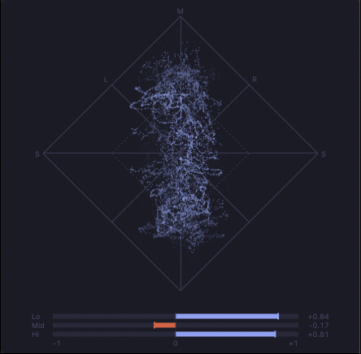

# Vectorscope

A stereo vectorscope (goniometer) UI element with a phase correlation meter for foobar2000 macOS. Contributed by [Scannou](https://github.com/Scannou).

## Features

### Goniometer

Every stereo sample is plotted as a point: the vertical axis is mid (L+R), the horizontal axis is side (L-R).

| Signal | Picture |
|--------|---------|
| **Mono** | Vertical line |
| **Left only** | Line leaning to the upper left |
| **Right only** | Line leaning to the upper right |
| **Wide stereo** | Rounded cloud |
| **Out of phase** | Horizontal line |

The diamond marks full scale at 0 dB gain; the dashed inner diamond is half scale (-6 dB).


### Afterglow

The trace fades over an adjustable time instead of being redrawn from scratch, like the phosphor of an oscilloscope tube. The brightest parts bleach towards white in dark mode.

### Trace Modes

| Mode | Description |
|------|-------------|
| **Lines** | Samples are joined; fast beam movement draws dimmer, so dense areas glow and jumps stay faint |
| **Dots** | One dot per sample, drawn as a point cloud |

### Gain

Auto gain follows the track's peak level (fast down, slow up) so quiet and loud material both fill the scope, within -6 dB to +30 dB. It holds through silence instead of rising between tracks. Turn it off to use a fixed gain of 0 to +36 dB.

### Correlation Meter

A bar under the scope showing how alike the two channels are.

| Reading | Meaning |
|---------|---------|
| **+1** | Mono: both channels identical |
| **0 to +1** | Normal stereo |
| **0** | Unrelated channels, or signal on one side only |
| **Below 0** | Out of phase: cancels when summed to mono |

Negative readings draw in red. The bar shows `--` while the signal is below about -70 dBFS.

### Three-Band Correlation

Optionally the meter splits into low, mid, and high bars with adjustable crossovers (24 dB/octave), showing which part of the spectrum is out of phase. A mix can read fine overall while its bass cancels in mono.



In this example the low and high bands are in phase while the mid band reads slightly negative.

### Grid

Full-scale diamond, mid and side axes, left-only and right-only diagonals, and L / R / M / S labels. Color and opacity are configurable (0% hides the grid).

### Color Themes

Eleven presets stamp trace, background, and grid colors for both light and dark appearance at once: Default (Phosphor Green), Blue, Amber, Nord, Dracula, Gruvbox, Solarized, Tokyo Night, Catppuccin, Monokai, Sunset. Editing any color well switches the theme selector to Custom.

### Glass Background

Optional translucent behind-window blur instead of a solid background color (same effect as SimPlaylist, Waveform Seekbar, and Spectrum Analyzer).

### Small Panels

The correlation meter hides when the panel is under 90 points in either direction, and the axis labels hide when the scope is under 120 points, so the scope keeps the available space.

## Configuration

Access settings via **Preferences > Display > Vectorscope**, or right-click the element and choose **Preferences...**. Changes apply live.


### Scope

| Setting | Description | Range | Default |
|---------|-------------|-------|---------|
| Trace | How samples are drawn | Lines, Dots | Lines |
| Afterglow | How long the trace takes to fade | 20-2000 ms | 300 ms |
| Brightness | Trace brightness | 0-100 | 60 |
| Auto gain | Scale the picture to the track's level | On / Off | On |
| Gain | Fixed gain used when auto gain is off | 0 to +36 dB | 0 dB |

### Correlation Meter

| Setting | Description | Range | Default |
|---------|-------------|-------|---------|
| Show correlation meter | Bar(s) under the scope | On / Off | On |
| Bands | One broadband bar or three band bars | Single, Low / Mid / High | Single |
| Response time | Window the reading is averaged over | 100-3000 ms | 500 ms |
| Crossovers (Hz) | Low / mid and mid / high splits | 40-1000 and 1000-12000 | 250 and 2000 |

### Appearance

| Setting | Description | Default |
|---------|-------------|---------|
| Theme | Color preset (Custom + 11 presets) | Default (Phosphor Green) |
| Show grid | Diamond, axes, and diagonals | On |
| Show labels | L / R / M / S and the correlation scale and readouts | On |
| Glass background | Translucent blur instead of solid color | Off |
| Grid opacity | Grid line and label opacity (0% hides) | 40% |
| Colors (Light / Dark) | Trace, background, and grid color per appearance | Green on light gray / phosphor green on near-black |

## Layout Editor

Add Vectorscope to your layout using any of these names:
- `vectorscope` (recommended)
- `Vectorscope`
- `vector_scope`
- `goniometer`
- `foo_jl_vectorscope`
- `jl_vectorscope`

The scope is square, so it sits well beside a wide panel. Example layout with the scope to the right of the spectrum analyzer:
```
splitter horizontal style=thin
  waveform-seekbar
  splitter vertical style=thin
    spectrum
    vectorscope
  simplaylist
```

## Technical Details

### Audio

- Raw samples come from `visualisation_stream_v2::get_chunk_absolute`; each frame reads exactly the audio played since the previous frame, so no samples are skipped or drawn twice
- Mono is duplicated to both channels; surround uses the first two channels (front left / front right)
- Correlation is the normalised L/R cross-correlation over an exponential window; band meters run the same measurement behind Linkwitz-Riley filters that are identical on both channels
- After a stall (window hidden, UI blocked) the scope resumes at the current position instead of replaying the gap

### Rendering

- The trace is a CPU intensity buffer at device resolution (capped at 1024 px), faded and added to every frame, then color-mapped and shown as a layer image on top of the Core Graphics grid
- 60 fps `NSTimer` on the main run loop (common modes); fades use real elapsed time, and nothing is redrawn once the trace has died away
- Stream released when the view goes off-screen; recreated lazily on the next tick

### Lifecycle

- An `initquit` service stops every live view's timer and releases its stream before the core tears down the visualisation backend; holding a stream through shutdown throws `exception_service_not_found` and aborts
- Settings persist via `fb2k::configStore` under the `foo_jl_vectorscope.` prefix (cfg_var does not persist on macOS v2)

### Tests

The stereo maths and the afterglow buffer are SDK-free and unit-tested (`Scripts/run_tests.sh`, 101 checks); the tests gate `build.sh`. See [Testable Core Pattern](testable-core-pattern.md).

## Requirements

- foobar2000 v2.x for macOS
- macOS 12.0 (Monterey) or later
